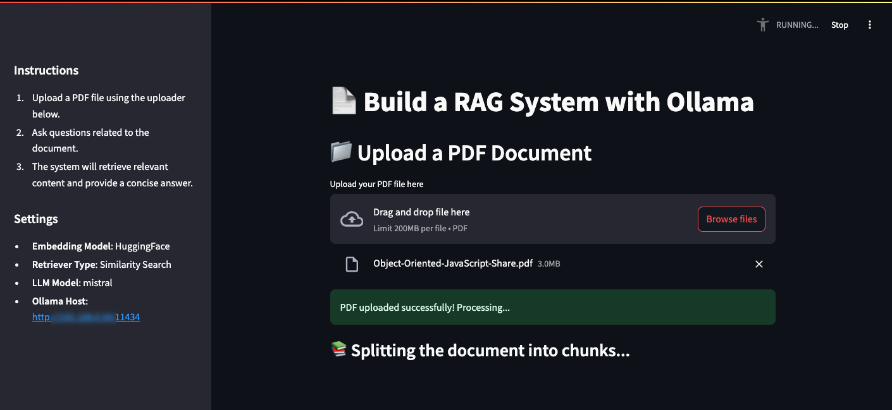

# DocuRAG: AI Powered PDF Q&A



## Overview

DocuRAG is a lightweight secure Retrieval-Augmented Generation (RAG) implementation for PDF-based question answering that leverages key Langchain components alongside modern AI stacks. It ingests PDFs via PDFPlumberLoader and uses semantic chunking powered by HuggingFace embeddings to generate context-aware document fragments. These fragments are embedded into a FAISS vector store for efficient similarity-based retrieval. The setup then employs a straightforward “stuffing” approach—directly combining retrieved context into a prompt for an LLM from Ollama.

### Key Advantages:

Local Processing & Enhanced Security:
By running entirely on local resources, DocuRAG ensures your sensitive documents never leave your machine. This reduces reliance on cloud services and minimizes data exposure, making it an ideal solution for environments where privacy and data security are paramount.

Simplicity and Maintainability:
The architecture is designed for moderate-sized documents, offering a simpler, more maintainable alternative to more complex production-grade RAG systems that rely on multiple distributed components or cloud-based APIs.

Efficient and Cost-Effective:
Leveraging powerful, instruction-tuned LLMs locally via Ollama and modern embedding techniques ensures fast, context-aware answers without the recurring costs and potential latency issues associated with cloud deployments.

Cloned from this tutorial: [Setting up Ollama & Running DeepSeek R1 Locally for a Powerful RAG System](https://dev.to/ajmal_hasan/setting-up-ollama-running-deepseek-r1-locally-for-a-powerful-rag-system-4pd4)

## System Requirements

- Linux, MacOS, Windows ( can run on one system or have Ollama on a second server )
- Python 3.12.3 (tested, other 3.x versions may work)

## Installation Instructions

### 1. Install Ollama

This can be installed on the computer you are developing on or a remote host and point your config.py `base_url` to that endpoint. You might host Ollama on a more powerful server so you can run larger models for example.

#### Linux / MacOS

```bash
curl -fsSL https://ollama.com/install.sh | sh
```

#### Windows

##### WSL

1. Install Windows Subsystem for Linux (WSL2)
2. Follow Linux installation instructions within WSL2

##### Installer

download from [Ollama Windows](https://ollama.com/download/windows)

### 2. Pull Ollama Model ( on Ollama host )

```bash
    ollama pull deepseek-r1:1.5b
```

### 3. Setup Python Environment

Setup python 3.12.3 ( or try other versions at your own risk ). Use whatever you like, but pyenv bellow is a good option.

```bash
pyenv install 3.12.3
pyenv local 3.12.3
```

#### Create Virtual Environment

Create virtual environment

```bash
python3 -m venv .venv
```

Activate virtual environment

On Linux/MacOS:

```bash
source .venv/bin/activate
```

On Windows:

```bash
.venv\Scripts\activate
```

#### Install Dependencies

Install required packages

```bash
pip install --upgrade pip
pip install -r requirements.txt
```

### 4. Configure Ollama Settings

The application uses a configuration system to manage Ollama settings:

1. Copy the template configuration to the build ready `config.py`:
```bash
cp config.template.py config.py
```

2. Edit `config.py` with your settings:
```python
OLLAMA_CONFIG = {
    "model": "your-preferred-model", # has to be installed on your Ollama server
    "base_url": "http://your.ollama.server:11434"
}
```

Note: `config.py` is ignored by git to keep your local settings private.

### 5. PDF Document Management

The application uses two locations for PDF files:

- `/pdf/` directory: Store your permanent PDF collection here
- `temp.pdf`: Working file in root directory (auto-generated when uploading)

When you upload a PDF through the UI:

1. The file is temporarily saved as `temp.pdf` in the root directory
2. This file is processed for the current session
3. The original PDFs in `/pdf/` remain unchanged

## Running the Application

1. Ensure Ollama service is running:

    Linux/MacOS

    ```bash
    ollama serve
    ```

    Windows (separate terminal)

    ```bash
    wsl -d Ubuntu -e ollama serve
    ```

2. Start the Streamlit app:

    ```bash
    streamlit run app.py
    ```

3. Open your browser and navigate to:

   - Local URL: http://localhost:8501
   - Network URL: Will be displayed in terminal

## Troubleshooting

### Common Issues

1. **CUDA Errors**
    If you see CUDA initialization errors but have a NVIDIA GPU:

    - Ensure NVIDIA drivers are installed
    - Install CUDA toolkit
    - Set environment variable: export CUDA_VISIBLE_DEVICES=0

2. **Memory Issues**
    If you encounter memory errors:

    - Close other applications
    - Use a smaller model variant
    - Reduce chunk size in the code

3. **Ollama Connection Issues**
    If Ollama fails to connect:

    - Ensure ollama serve is running
    - Check if port 11434 is available
    - Verify firewall settings

### Platform-Specific Notes

#### Linux

- Ensure CUDA drivers are installed for GPU support
- May need to run with sudo for first-time setup

#### MacOS

- M1/M2 chips are supported natively
- Intel Macs may need Rosetta 2

#### Windows

- WSL2 recommended for best performance
- Native Windows support is in beta
- May need to configure Windows Defender exceptions

## References

- [Original Tutorial](https://dev.to/ajmal_hasan/setting-up-ollama-running-deepseek-r1-locally-for-a-powerful-rag-system-4pd4)
- [Ollama Documentation](https://ollama.com/docs)
- [Model Information](https://ollama.com/library)
- [Streamlit Documentation](https://docs.streamlit.io)

## License

This project is licensed under the MIT License - see the LICENSE file for details.
